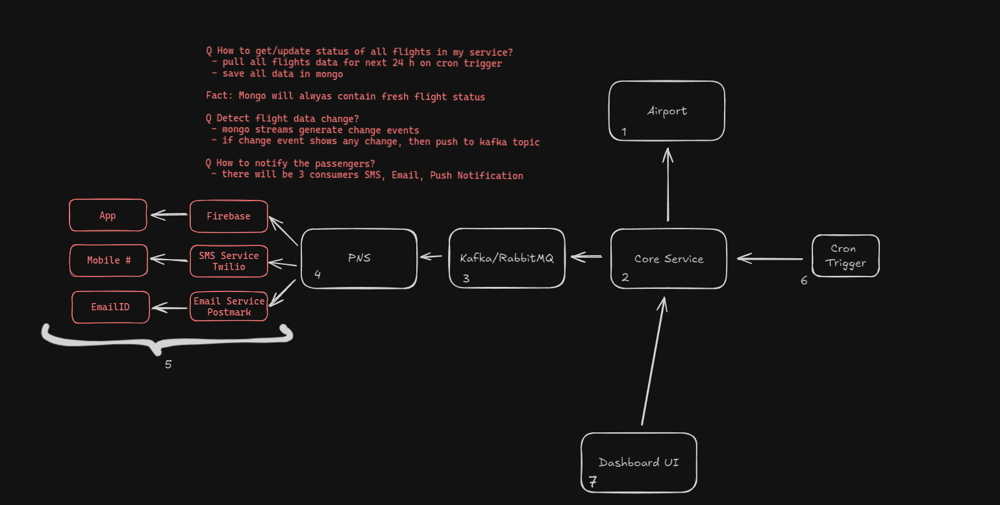

# About Application

This is the orchestration service that handles checking if status of any flight changed or not and send SMS, email to users based on status updates

## IMPORTANT

This service relies on kafka as its message broker so make sure to install setup and run the servers

## To run the Kafka Serve

Install and run docker

`https://docs.docker.com/engine/install/`

To run Kafka server from the project root directory run the following command

`docker-composer up -d`

To run the application make sure you have maven installed

`https://maven.apache.org/install.html`

Make sure PostgreSQL with database named `airline_queries` is running

Make sure you have atleast Java 17 installed and added to PATH

Finally install dependcies and run

```
mvnw install

mvnw springboot:run
```

The local developement server will start on `localhost:8080`

# Application Architechture



## This Service is broken down into 7 peice below is a short explation for each one 

1. Airport: This is external entiry i.e, database on airport side, We have mocked the service in this case which can be fond in `AirportService` package

2. Core Service: Pulls data from airport checks ini there are any changes and persist in db then push message to kafka if found, implementaion in `Core Service` package

3. Kafka: This is message broker for this application

4. PNS: This service is responsible for reading the message from Kafka queue and sending updates through appropriate channel by invoking their respective services. Implementation can be found in `NotificationService` package

5. These services will actually send notifiaction/sms/updates

6. Cron trigger is responsible for polling `AirportService` at fixed intervals in this case 5 mins

7. A user can see changes and current statuses on [Dashboard](https://github.com/SakshamGairola/indigoHack-Frontend) application